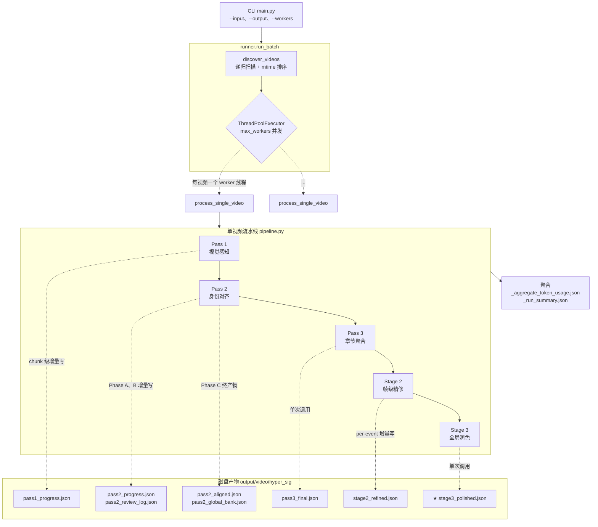
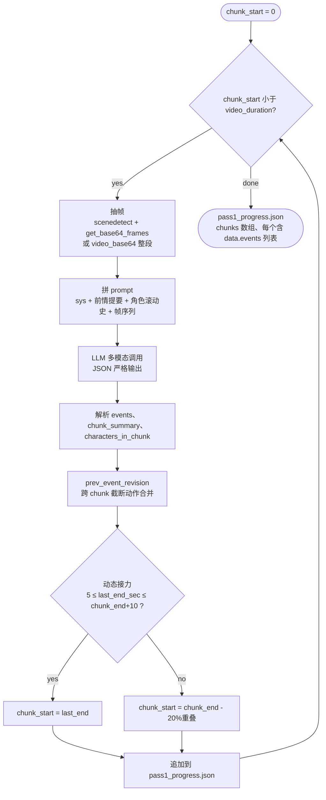
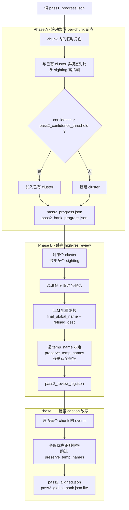
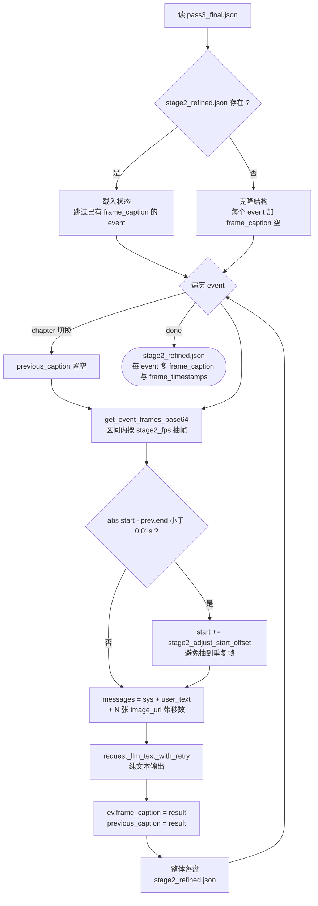

# Long Video Caption v2

长视频结构化打标流水线，五个阶段串行：**视觉感知 → 身份对齐 → 章节聚合 → 帧级精修 → 全局润色**。
支持文件夹批量、多线程并发、按内容稳定路径的细粒度断点续打、分阶段 Token 统计。

---

## 整体架构



> ★ `stage3_polished.json` 是最终交付产物；`pass3_final.json` 是不带 frame-level 精修的中间稳定版本（也可单独消费）。

---

## 各阶段细节

### Pass 1 — 视觉感知（chunk 级 LLM 多模态调用）



**关键不变量**：events **首尾相连**逐字相等（`events[i+1].start_time == events[i].end_time`），由 prompt 强制约束。

---

### Pass 2 — 滚动身份对齐（三阶段）



**关键约束**：
- Phase A 决策一旦写盘即定；Phase B **不再做拆分**，只决定是否替换。
- `preserve_temp_names` 只接受 cluster 实际包含的 temp_name；模型幻觉的临时名会被丢弃并打印 warn。
- Phase B/C 都会逐 sighting 应用 preserve 名单，避免"同一角色不同形态"被错误统一（如活体↔骸骨、揭面前↔揭面后）。

---

### Pass 3 — 章节聚合 + 层级装配（单次 LLM 调用）

输入由三层组合而成（详见 [pass3.py](longvideocaption/pass3.py)）：

```
【全局角色图鉴】           ← 来自 pass2_global_bank.json
- [李雷]: 二十多岁男性...
- [韩梅梅]: ...

【分段叙事摘要（按 chunk 顺序）】 ← 来自每个 chunk 的 chunk_summary
第1段 [00:00:00-00:01:00]: ...
第2段 [00:01:00-00:02:00]: ...

【完整底层时间轴】          ← 每个 event 的 step3_synthesized_dense_caption
[00:00:01.250] - [00:00:08.500] : ...
...
```

模型输出 chapters 切分后，本地 `_assemble_final` 按时间区间把 events 物理挂载到对应 chapter（浮点容差 `-0.5s`，最后一章 `+9999s` 兜底，越界事件追加为 `ev_fallback_*`）。

每次运行都会落 `_debug_pass3_input.txt` 与 `_debug_pass3_chapter_response.json` 用于排错。

---

### Stage 2 — 事件级帧精修（per-event 串行）



**关键约束**：
- **串行处理** —— 当前 event 必须用上一个 event 的 `frame_caption` 作为前序上下文。
- **chapter 边界**：首事件不传 `previous_caption`，避免章节叙事污染。
- **失败容错**：单 event 抽帧/调用失败仅跳过该 event，不阻断后续。

---

### Stage 3 — 全局精修（单次纯文本 LLM 调用）

把所有 chapter/event 拼成 `{chapters:[{chapter_id, chapter_title, events:[{event_id, caption}]}]}` 一次性喂给模型，回填每个 event 的 `final_caption`。模型未回填的 event 退回到 `frame_caption`/`step3_synthesized_dense_caption`。

主要做：跨章节叙事缝合、指代统一去冗余、消除 "视频开头/纠正：xxx" 之类元描述与负向纠错痕迹。

---

## 断点续打矩阵

路径按内容（视频名 + 超参签名）稳定 → **重跑同样的命令即自动续打**，不需要任何特殊参数。

| 删除（或不存在）的文件                                 | 重跑范围                                            |
|--------------------------------------------------------|-----------------------------------------------------|
| `pass1_progress.json`                                  | Pass 1 → Pass 2 → Pass 3 → Stage 2 → Stage 3        |
| `pass2_progress.json`                                  | Pass 2 (A+B+C) → Pass 3 → Stage 2 → Stage 3         |
| `pass2_review_log.json`                                | Pass 2 (B+C) → Pass 3 → Stage 2 → Stage 3           |
| `pass2_aligned.json` 或 `pass2_global_bank.json`       | Pass 2 (C) → Pass 3 → Stage 2 → Stage 3             |
| `pass3_final.json`                                     | Pass 3 → Stage 2 → Stage 3                          |
| `stage2_refined.json`                                  | Stage 2（已有 `frame_caption` 的 event 仍跳过）→ Stage 3 |
| `stage3_polished.json`                                 | 仅 Stage 3                                          |

---

## 目录结构

```
LongVideoCaption_v2/
├── main.py                       # CLI 入口
├── .vscode/launch.json           # VSCode 调试配置
└── longvideocaption/
    ├── config.py                 # PipelineConfig + hyper_signature
    ├── utils.py                  # 时间戳 / JSON 清洗 / 文件名安全化
    ├── token_tracker.py          # per-video Tracker + 全局聚合器（带锁）
    ├── llm_client.py             # JSON / 纯文本两种 LLM 调用，统一重试 + token hook
    ├── frame_extractor.py        # scenedetect 抽帧 / chunk 视频 / 单帧 / 区间抽帧
    ├── pass1.py                  # Pass 1 视觉感知
    ├── pass2.py                  # Pass 2 三阶段身份对齐
    ├── pass3.py                  # Pass 3 章节聚合 + 装配
    ├── stage2.py                 # Stage 2 事件级帧精修
    ├── stage3.py                 # Stage 3 全局润色
    ├── pipeline.py               # 单视频串联 5 阶段
    ├── runner.py                 # 文件夹扫描 + ThreadPoolExecutor
    └── prompts/                  # pass1_v3 / stage2_v1 / stage3_v1 prompts
```

---

## 依赖

```bash
pip install openai httpx opencv-python numpy scenedetect
```

---

## 快速上手

### 单视频

```bash
python main.py \
  --input  D:/videos/I5cFBi02O34.mp4 \
  --output D:/outputs_v2 \
  --api-key YOUR_KEY \
  --base-url https://az.gptplus5.com/v1
```

### 文件夹批量 + 3 并发

```bash
python main.py \
  --input  D:/videos \
  --output D:/outputs_v2 \
  --workers 3 \
  --api-key YOUR_KEY \
  --base-url https://az.gptplus5.com/v1
```

### VSCode 调试

`.vscode/launch.json` 里已预置三条配置：
- **单视频打标** — 1 并发，适合 debug 单条视频。
- **文件夹批量打标 (3 并发)** — 批量 + 并发。
- **自定义超参 (video_base64 / 90s chunk)** — 演示 payload / chunk / fps 等参数覆盖。

使用前请把 `YOUR_API_KEY_HERE` 和输入输出路径替换成你本地的实际值。

---

## CLI 参数

| 参数              | 说明                                     | 默认                         |
|-------------------|------------------------------------------|------------------------------|
| `--input`         | 视频文件 **或** 文件夹（必填）           | —                            |
| `--output`        | 输出根目录（必填）                       | —                            |
| `--workers`       | 并发视频数                               | `2`                          |
| `--api-key`       | OpenAI 兼容 API key                      | 空（必须传或改 config.py）   |
| `--base-url`      | API base URL                             | 空（必须传或改 config.py）   |
| `--model`         | 模型名                                   | `gemini-3.1-pro-preview`     |
| `--chunk`         | `chunk_duration_sec`                     | `60`                         |
| `--payload`       | `image_list` / `video_base64`            | `image_list`                 |
| `--max-frames`    | 每 chunk 最大帧数                        | `240`                        |
| `--scene-thresh`  | scenedetect 阈值                         | `27.0`                       |
| `--frame-width`   | 帧宽（缩放上限）                         | `960`                        |
| `--target-fps`    | video_base64 采样帧率                    | `1.0`                        |
| `--conf-thresh`   | Pass 2 身份对齐置信度拦截阈值            | `80`                         |

进阶超参（Stage 2/3 的 fps、max_frames、temperature、max_tokens 等）在 `longvideocaption/config.py` 的 `PipelineConfig` 里改默认值。

---

## 输出结构

```
{output}/
├── _aggregate_token_usage.json     # 所有视频 per-stage + 总量汇总
├── _run_summary.json               # 每个视频的 success/failed + 产物路径
│
└── {video_basename}/
    └── {hyper_sig}/                # 例: gemini-3.1-pro-preview__chk60s__image_list__mf240__sc27_0__fw960__ovlp0
        ├── pass1_progress.json     # Pass 1 事件流（chunk 级增量写）
        ├── pass2_progress.json     # Pass 2 Phase A 断点（含 base64，跑完可删）
        ├── pass2_bank_progress.json
        ├── pass2_review_log.json   # Pass 2 Phase B 终审日志
        ├── pass2_aligned.json      # Pass 2 终产物：身份对齐后的事件流
        ├── pass2_global_bank.json  # 全局角色图鉴（lite，含名字 + 外貌）
        ├── pass3_final.json        # Pass 3 终产物：层级章节 JSON
        ├── _debug_pass3_input.txt        # Pass 3 实际喂给模型的完整 prompt
        ├── _debug_pass3_chapter_response.json  # Pass 3 模型原始返回
        ├── stage2_refined.json     # Stage 2 终产物：每 event 多 frame_caption
        ├── stage3_polished.json    # ★ Stage 3 终产物：最终 final_caption
        ├── token_usage.json        # 本视频分阶段 token 消耗
        └── run_meta.json           # 运行时间戳 + 配置快照 + status
```

### `stage3_polished.json` 结构（最终交付）

```json
{
  "video_path": "...",
  "video_summary": "全片总结",
  "chapters": [
    {
      "chapter_id": "ch_01",
      "title": "章节标题",
      "chapter_summary": "本章总结",
      "start_time": "[00:00:00.000]",
      "end_time": "[00:05:30.000]",
      "events": [
        {
          "event_id": "ev_01_001",
          "start_time": "...", "end_time": "...",
          "step1_objective_visual": "Pass 1 客观画面",
          "step2_contextual_reasoning": "Pass 1 剧情与情绪归因",
          "step3_synthesized_dense_caption": "Pass 1 融合描述（含 [全局角色名]）",
          "frame_caption": "Stage 2 事件级帧精修结果",
          "frame_timestamps": [12.5, 13.5, ...],
          "final_caption": "★ Stage 3 全局润色后的最终描述",
          "characters_in_event": [{"name": "[李雷]", "desc": "..."}],
          "key_frame_times": ["..."]
        }
      ]
    }
  ]
}
```

---

## Token 统计

每次 LLM 调用都会通过 `llm_client.request_llm_with_retry` / `request_llm_text_with_retry` 读取 `completion.usage`，按 stage 名累加到 per-video `TokenTracker`：

| Stage 名                       | 来源                              |
|--------------------------------|-----------------------------------|
| `pass1_perception`             | Pass 1 chunk 级多模态调用         |
| `pass2_alignment`              | Pass 2 Phase A 滚动聚类           |
| `pass2_review`                 | Pass 2 Phase B 高清终审           |
| `pass3_aggregation`            | Pass 3 章节切分                   |
| `stage2_frame_inspection`      | Stage 2 per-event 帧精修          |
| `stage3_global_polish`         | Stage 3 全局润色                  |

- **单视频级**：`{run_dir}/token_usage.json`
- **批量聚合**：`{output}/_aggregate_token_usage.json`（含 `per_video` / `per_stage_totals` / `grand_total`）

---

## 并发模型

- 每个视频独立 worker 线程 → 独立 `OpenAI` client / `httpx.Client` / `cv2.VideoCapture`，互不干扰。
- 视频内部各阶段**严格串行**（Pass 2 Phase A 需要 chunk 顺序、Stage 2 依赖前一 event 的精修结果）。
- `GlobalTokenAggregator` 是唯一跨线程共享对象，带 `threading.Lock`，每视频收尾时调用一次。
- 建议 `--workers` 别调太大，受 LLM 厂商 QPS / TPM 限制，2–4 一般足够。

---

## 已知注意事项

- `config.py` 里 `api_key` / `base_url` 默认空串，必须通过 CLI 或修改默认值来提供。
- scenedetect 多线程可用，但每个视频内部是同步 CPU 计算，大批量并发需留意 CPU。
- Stage 2 所有 event 串行 → 长视频耗时较长（事件数 × 单调用耗时），可以根据需要在 `config.py` 调小 `stage2_max_frames` 来提速。
- Pass 3 的 `_debug_*` 文件每次都会覆盖写入，仅供当次排错使用，不要直接消费。
